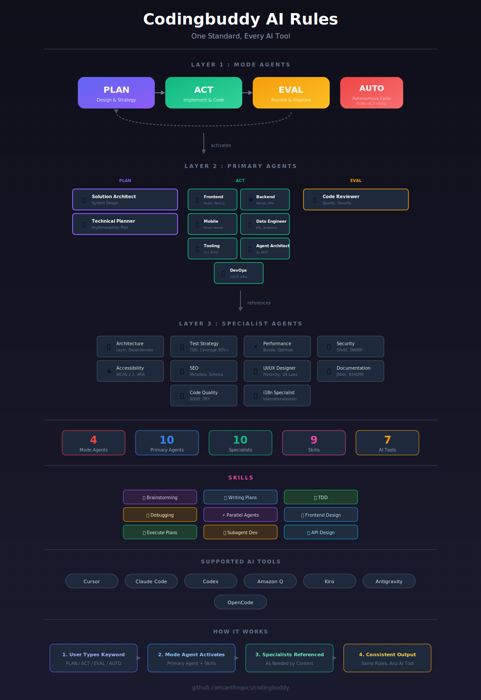

<p align="center">
  <a href="README.md">English</a> |
  <a href="README.ko.md">한국어</a> |
  <a href="README.zh-CN.md">中文</a> |
  <a href="README.ja.md">日本語</a> |
  <a href="README.es.md">Español</a>
</p>

# Codingbuddy

[](https://github.com/JeremyDev87/codingbuddy/actions/workflows/dev.yml)
[](https://www.npmjs.com/package/codingbuddy)
[](https://opensource.org/licenses/MIT)

<p align="center">
  
</p>

**すべてのAIアシスタントで統一されたAIコーディングルールの単一ソース。**

Codingbuddyは、Cursor、Claude Code、GitHub Copilotなどと連携する統合ルールシステムを提供し、チーム全体がどのAIツールを使用しても同じコーディング標準に従うことができます。

## なぜCodingbuddyなのか？

- **一貫性**: すべてのAIツールが同一のコーディング標準に従う
- **単一ソース**: ルールを一度更新すれば、すべてのツールに反映
- **ベンダーロックインなし**: AI非依存のルールがあらゆるアシスタントと連携
- **構造化されたワークフロー**: PLAN → ACT → EVAL 開発サイクル

## クイックスタート

```bash
# プロジェクトを初期化（APIキー不要）
npx codingbuddy init

# オプション：AI駆動の初期化でより深い分析
# npx codingbuddy init --ai  # ANTHROPIC_API_KEYが必要

# AIツールに追加（例：Claude Desktop）
# 他のAIツールについてはdocs/ja/supported-tools.mdを参照
```

Claude Desktop設定に追加（`~/Library/Application Support/Claude/claude_desktop_config.json`）：

```json
{
  "mcpServers": {
    "codingbuddy": {
      "command": "npx",
      "args": ["codingbuddy", "mcp"]
    }
  }
}
```

[詳細なセットアップガイド →](docs/ja/getting-started.md)

## 対応AIツール

| ツール | ステータス |
|--------|------------|
| Claude Code | ✅ 完全なMCPサポート |
| Cursor | ✅ 対応 |
| GitHub Copilot | ✅ 対応 |
| Antigravity | ✅ 対応 |
| Amazon Q | ✅ 対応 |
| Kiro | ✅ 対応 |
| OpenCode | ✅ 対応 |

[セットアップガイド →](docs/ja/supported-tools.md)

## ドキュメント

| ドキュメント | 説明 |
|--------------|------|
| [はじめに](docs/ja/getting-started.md) | インストールとクイックセットアップ |
| [設計思想](docs/ja/philosophy.md) | ビジョンと設計原則 |
| [対応ツール](docs/ja/supported-tools.md) | AIツール統合ガイド |
| [設定リファレンス](docs/config-schema.md) | 設定ファイルオプション |
| [APIリファレンス](docs/api.md) | MCPサーバー機能 |
| [開発ガイド](docs/development.md) | 貢献とローカルセットアップ |

## 仕組み

上記のアーキテクチャ図で3層エージェントシステムの全体像をご確認ください：

- **Layer 1（モードエージェント）**：PLAN → ACT → EVAL ワークフローサイクル
- **Layer 2（主要エージェント）**：Solution Architect、Technical Planner、Frontend/Backend/Mobile/Data Developer、Tooling Engineer、Agent Architect、Code Reviewer、DevOps
- **Layer 3（スペシャリスト）**：10名のドメイン専門家（セキュリティ、パフォーマンス、アクセシビリティ、i18nなど）
- **スキル**：再利用可能な機能（TDD、デバッグ、ブレインストーミングなど）

すべてのAIツール設定が同じ`packages/rules/.ai-rules/`ディレクトリを参照します。ルールを一度変更すれば、すべてのツールが更新された標準に従います。

## コントリビューション

貢献を歓迎します！ガイドラインについては[CONTRIBUTING.md](CONTRIBUTING.md)をご覧ください。

## ライセンス

MIT © [Codingbuddy](https://github.com/JeremyDev87/codingbuddy)
